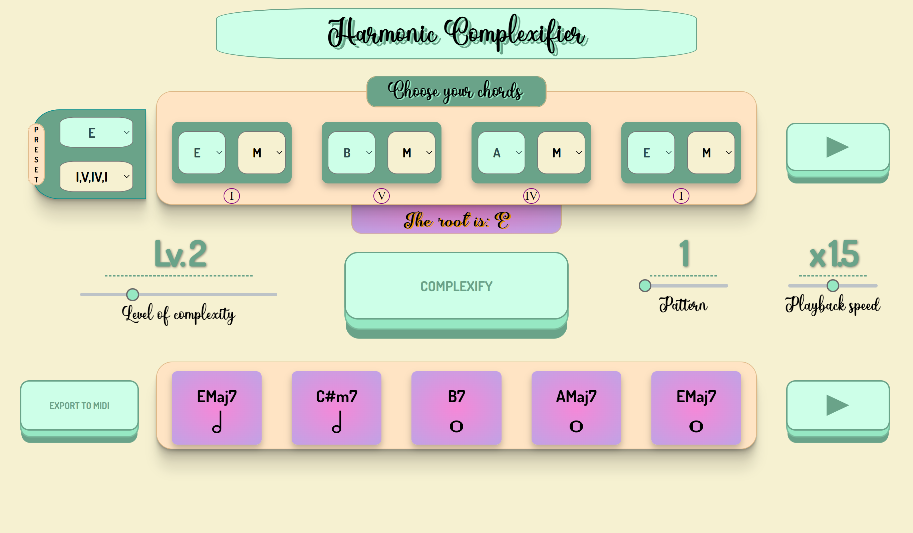

# Harmonic Complexifier
Advanced Coding Tool and Methodologies & Computer Music Representation and Models - Politecnico di Milano - Music and Acoustic Engineering 2022/2023

  

## Introduction
The "Harmonic Complexifier" is a web-developed software that allows the user to add up to 5 level of complexity to a commonly structured 4-chords sequence, given as input. 
The main idea of this project was to develop a sort of didactic tool that enables inexperienced musicians to generate intricate and dynamically evolving chord sequences. This would be accomplished by using specific musical rules and substitutions, which will be discussed in detail later.

## Features
- up to six possible "complexifiable" sequences
- seven possible chord types as input, including diminished and diminshed 7th
- preset selection, allowing the user for a quicker input by giving only a root and a sequence
- level of complexity selection
- chord sequence playback, to compare the obtained result with the input
- 2 different playing patterns: Strummed and Finger-Picked
- 3 levels of playback speed
- guitar tablature for the outputted chords
- midi file export of the "complexified" sequence 

## Implementation
Let's now see in detail how these features have been implemented.

### Sequence Recognition and Root Finding
### Complexifying the Sequence
### Audio playback
### Midi Export
### User Interface

## Conclusion
We believe that the "Harmonic Complexifier" succeds in its purpouse of guiding a beginning musician in music theory. by encouraging him to evolve and vary using the level of complexity and transformations he likes best.
There are some aspect that could be improved or added in following implementations, such as increasing the possible sequences to work with and the harmonization of minor keys. Also, it would be a nice addition to differ the musical instruments with which the result can be heard, and visualize the tablature of the outputted chords for those instruments as well.

