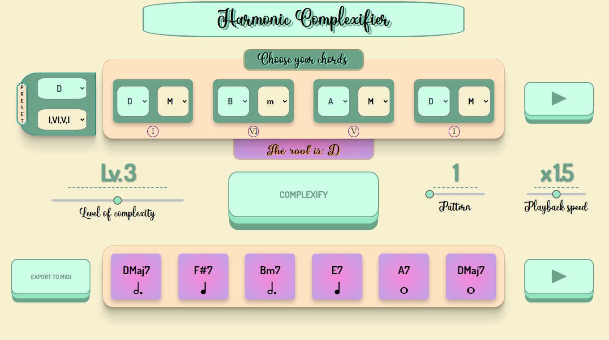
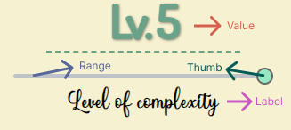
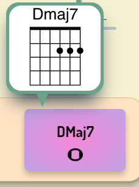

# Harmonic Complexifier
Advanced Coding Tool and Methodologies & Computer Music Representation and Models - Politecnico di Milano - Music and Acoustic Engineering 2022/2023


by Nicolò Chillè, Michele Murciano and Rocco Scarano
<p>
  
</p>

## Introduction
The "Harmonic Complexifier" is a web-developed software that allows the user to add up to 5 level of complexity to a commonly structured 4-chords sequence, given as input. 
The main idea of this project was to develop a sort of didactic tool that enables inexperienced musicians to generate intricate and dynamically evolving chord sequences. This would be accomplished by using specific musical rules and substitutions, which will be discussed in detail later.

## Features
- up to six possible "complexifiable" sequences
- seven possible chord types as input
- preset selection, allowing the user for a quicker input by giving only a root and a sequence
- level of complexity selection
- chord sequence playback, to compare the obtained result with the input
- 2 different playing patterns: Strummed and Finger-Picked
- 3 levels of playback speed
- guitar tablature for the outputted chords
- midi file export of the "complexified" sequence 

## Implementation
Let's now see how these features have been implemented.

### Complexifying the Sequence

To complexify the sequence, we proceed with the following order:
1. Find the root of the sequence 
2. Find the most similar sequence
3. Complexify the sequence

#### Root Finding

Having converted the inputted sequence is converted into an array of Object, structured as {note: note_name, type: chord_type, duration: 4}, we check for the root of the sequence if present.
This is done by using the "keyfinder()" function: 
we build the major scale for each chord note by using the "scaleBuilder(note)" function, which returns an array of all the chords in the given scale, both in triads and in tetrads.

All the music related data is contained under the [notes&chords.js](Resources/notes&chords.js) file.


If one of the given scales contains all the chords of the sequence, then that will be the root of the sequence.
If none of the scales contains all the chords, the scale that contains at least 3 chords will be considered as the root.
Here's a snippet of the function:
```
export function keyFinder(){
    let chords = updateValues();  //obtain the array of chords
    let chords_in = 0;
    let tonic = '';
    for (let i = 0; i < chords.length; i++){ //create the scale for each of the chords note
        let scale = scaleBuilder(chords[i].note);
        let chords_in_new=0;
        for (let j = 0; j < chords.length; j++){
            if(containsChord(scale,chords[j]))
                chords_in_new+=1;
        }
        if (chords_in_new>chords_in) { //update the tonic if the number of chords contained is higher than the previous one
            chords_in = chords_in_new;
            tonic=chords[i].note;
        }
        if (chords_in == 4) //if it contains all the chords, that note will be the root
            return tonic;
    }
    if (chords_in > 2) //the root of the scale containing at least 3 chords will be returned as the root of the sequence
        return tonic 
```
If none of the scales contains at least 3 chords, then we check all the other possible major scales.
If one of the scales satisfies the previous mentioned requirements, the root of that scale will be considered as the root. Else, the function returns false and the sequence won't be complexified.

#### Sequence Finder
We then check if the sequence of chords that has been inputted by the user fits with the possible sequences used by the software. In fact, this implementation of the Harmonic Complexifier works only with these 6 different sequences of chords:
- I-ii-V-I
- I-IV-V-I
- I-V-IV-I
- I-vi-V-I
- I-vi-ii-V
- I-V-vi-IV

The sequence finder recognizes also sequences that differ up to a chord from the previously given ones, as long as the **cadence** is respected.
_(e.g. if the user inputs a sequence as_ ii-V-I-"chord not in scale"_, the software will convert the input into a_ I-ii-V-I _sequence. Although, if the chord inserted is still in the scale of the sequence, the conversion won't happen)._

Of course, if the inputted sequence isn't found between the ones used by this software, the complexifying step won't happen.

### Complexify
We can now proceed to complexify the sequence, according with the level chosen by the user. In fact, we've implemented up to 5 level of complexity, with the following methods:
1. Transition from triads to tetrads
2. Relative minor substitution
3. Secondary dominant substitution
4. Parallel minor substitution
5. Tritone substitution

The levels are cumulative: a sequence complexified with a level 4 will contain all the substitution from level 1 to level 4.

Here's a snippet of the "complexify(lvl)" function, which transfroms the sequence:
```
    ... //steps described in the previous sections
    
    if(lvl) {
        newChords = triadsToQuadriads(tonic,seq);
        lvl-=1;
    }
    if(lvl) {
        newChords = relativeMinor(tonic,newChords,seq);
        lvl-=1;
    }
    if(lvl) {
        newChords = secondaryDominant(tonic,newChords,seq)
        lvl-=1;
    }
    if(lvl) {
        newChords = parallelKey(tonic,newChords,seq)
        lvl-=1;
    }
    if(lvl)
        newChords = tritone(seq,newChords)

    showChords(newChords);
    return newChords;
}
```
As we can see, each substitution is implemented with its own function. All the functions used for this process can be found inside the [complexifyFunc.js](Resources/complexifyFunc.js) file.

### Audio playback

One of the features implemented is the ability to playback both the inputted and the outputted sequences. To implement the audio playback, we've decided to use the [Howler.js](https://github.com/goldfire/howler.js/) audio library, which allowed us to compose the chords sequences by putting together multiple '.wav' files.

Each chord is registered with a guitar in a wav file, lasting a quarter note. Therefore, to playback a chord lasting 4 quarters, we just play 4 times the single wav file. This implementation allowed us to dynamically switch between different chords duration without having to cut or record multiple wav files for each single chord.

The sequence is played back in a loop, using the "setTimeout()" function given by JavaScript. 

Here's a snippet of the implementation, with source building and sequencing. The audio implementation of this software can be found in the [audio.js](Resources/audio.js) file.

```
//plays the sequence 
export function play(pattern, chords,bpm){
    if(isPlaying) 
        return    //if the sound is already playing, don't do anything
    ...
    source = buildSource(pattern,chords)
    let sound = buildSound(source)
    isPlaying=true
    ...
    sequencer(sound,0,bpm)
}

//plays sequentially the wav files stored in the audio parameter
//loops back once the audio file is finished

function sequencer(audio,i,bpm){
    Howler.stop()
    if(!isPlaying)
        return
    audio[i].play()
    //Calculate the duration of the wav file
    let dur = (60/bpm)*1000
    //Loop this operation using setTimeout
    seq = setTimeout(() => sequencer(audio,(i+1)%audio.length,bpm),dur)
}

//stops the sequencer
export function stop(){
    Howler.stop()
    clearTimeout(seq)
    isPlaying=false;
}

//build the audio array for the sequencer
function buildSource(pattern, chords){
    let sources = []
    //set the common path for the audio files
    let begin = 'AudioFiles/Pattern'+String(pattern)+'/'
    ...
    //gets the note and type of each chord, and adds the corresponding wav file to the source
    for (let i = 0; i<chords.length; i++){
        let note = chords[i].note
        note = note.replace('#','s')
        let type = chords[i].type
        if(type==='M')
            type=''
        for(let j=0; j<chords[i].duration; j++)
            sources = sources.concat([begin + String(note) + String(type) + String(add) + '.wav'])
    }
    return sources
}

...
```
### Midi Export

Another useful feature is the possibility to export the complexified sequence as a midi file.

To do so, we've used the [midi-writer-js](https://github.com/grimmdude/MidiWriterJS) library, which provides an API for generating expressive multi-track MIDI files.

The implementation is straight-forward: we extract the notes composing each chord of the outputted sequence, create a note Event of the length of the chord and add it to the midi track.

Once all the chords have been added to the midi track, a download URL is generated, allowing the user to download the track.

Here's a snippet:
```
//exports to midi the outputted sequence and downloads it 
function exportMidi(){
    if(!newChords.length)
        return
    const url = midiExport(newChords)
    const link = document.createElement('a');
    link.href = url;
    link.download = 'complexified_progression_lvl' + document.getElementById("complexLvl").value +'.mid';
    document.body.appendChild(link);
    link.click();
    document.body.removeChild(link);
}
```
The implementation of midiExport can be found inside the [midiExport.js](Resources/midiExport.js) file.
### User Interface
#### CSS Grid layout
The Graphical User Interface of the Harmonic Complexifier is a grid-based GUI obtained through the use of <b>CSS Grid layout</b>. Thanks to this powerful layout system, a flexibile and responsive layout has been obtained in a more intuitive and easier way. \
For example, the entire page is based on the following grid: 
```
.grid-container{
    display: grid;
    grid-template-columns: repeat(6, 1fr); /*six column of 1fr */
    grid-template-rows: 1fr 3.2fr auto 3fr;
    grid-column-gap: 0.25em;
    grid-row-gap: 4%;
}
```

#### 3D Button
A peculiar feature of the Harmonic Complexifier GUI consists in the style of the buttons:
<p>
  
  
  
</p>
The 3D style of the buttons has been achieved thanks to the pseudo-element <b>::before</b> which creates a layered effect adding a sense of depth and a 3D-like appearance to the button. In particular, within <b>.big-button::before</b>, the <b>transform</b> property in combination with <b>translate3d()</b> function is responsible for creating the 3D effect. In addiction, by applying various background colors, border radius, and box shadow to the pseudo-element, the 3D effect of the button is enhanced.

```
.big-button::before {
    position: absolute;
    content: "";
    width: 100%; height: 100%;
    top: 0; left: 0; right: 0; bottom: 0;
    background: var(--colorShadeC);
    border-radius: inherit;
    box-shadow: 0 0 0 2px var(--colorShadeB), 0 0.75em 0 0 var(--colorShadeA);
    transform: translate3d(0, 0.75em, -1em);
    transition: all 175ms cubic-bezier(0, 0, 1, 1);
}
```

#### Range Slider
Another important object which builds up this graphical interface is the HTML input element of the type <b>range</b>. \
The Harmonic Complexifier provides three sliders which play different role but they all share the same CSS style:
<p>
  
  
  
</p>
Each slider is composed by the following elements: <b>value</b>, <b>label</b> and the type <b>range</b> input with the so-called <b>thumb</b> (the small and movable indicator that users can interact with by clicking or dragging to set a specific value on the slider): 
<p>

</p> 
<p>
  
</p>
These elements are wrapped together in a container for a better positioning of each entire slider. 

#### Input chords
The user is allowed to choose the <b>note</b> and the <b>type</b> of note of each input chord by the means of two HTML <b>select</b> element; \
by clicking on the arrow, a drop-down list of options is created and the user can choose only one value in this case.
<p>
  
</p>

The input chords can be also selected using the <b>Preset menu</b> which contains two other HTML <b>select</b> elements, the first one for the notes and the second one for the sequences:

<p>
  
</p>

#### Output chords
Each output chord box contains two fundamental elements: the output chord <b>name</b> and the output chord <b>duration symbol</b>. \
For example:
<p>
  
</p>

Last but not least, once the complexified chords are outputted, the user can visualize the corresponding guitar chord chart hovering on each output chord box:
<p>
  
</p>

## Conclusions
We believe that the "Harmonic Complexifier" succeds in its purpouse of guiding a beginning musician in music theory, by encouraging him to evolve and vary using the level of complexity and transformations he likes best.
There are some aspect that could be improved or added in following implementations, such as increasing the possible sequences to work with and the harmonization of minor keys. Also, it would be a nice addition to differ the musical instruments with which the result can be heard, and visualize the tablature of the outputted chords for those instruments as well.


